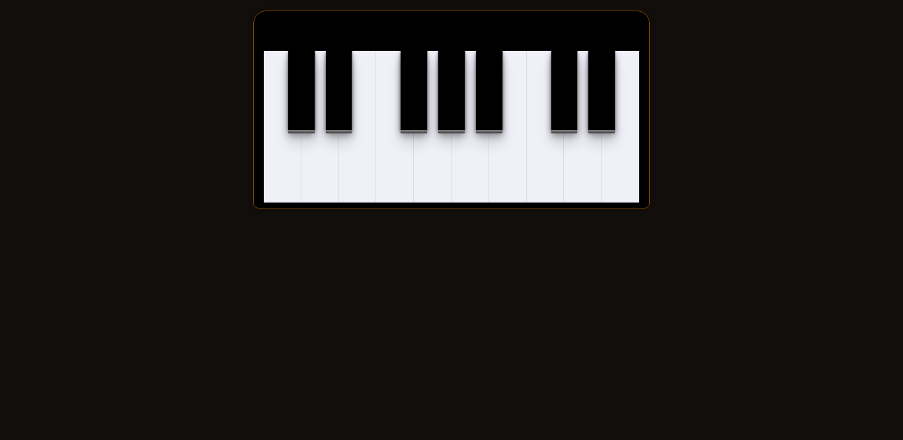

# Masterclass #18 - DOM

  Entendendo a DOM atráves de um piano básico.

  <a href="#-javascript-dom">DOM</a>&nbsp;&nbsp;&nbsp;|&nbsp;&nbsp;&nbsp;
  <a href="#-tecnologias">Tecnologias</a>&nbsp;&nbsp;&nbsp;|&nbsp;&nbsp;&nbsp;
  <a href="#memo-licença">Licença</a>

  

 

  

## 💻 JavaScript DOM

A `DOM` significa `Document Object Model`, que é uma maneira que o JavaScript tem de se conectar diretamente com o HTML. Representando elementos HTML em forma de objetos para o JavaScript.

Existem ferramentas que utilizam uma Virtual DOM, como o `ReactJS` e o `VueJS`. Estas ferramentas criam a DOM virtual para poderem trabalhar. E a DOM do JS Vanilla não se aplica à esses frameworks.

Veja o piano clicando nesse [link](https://matheusfdosan.github.io/masterclass-dom-18/).

## 🚀 Tecnologias

Esse projeto foi desenvolvido com as seguintes tecnologias:

- HTML e CSS
- JavaScript DOM
- Git & Github

## :memo: Licença

Esse projeto está sob a licença MIT.

---

Feito com ♥ by Rocketseat :wave: [Participe da nossa comunidade!](https://discord.gg/rocketseat)
